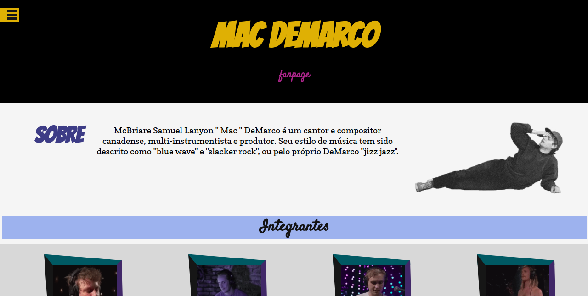

# Mac deMarco: Fanpage

## Descrição:

O projeto consiste de uma página fã sobre o cantor Mac deMarco.

## Funcionalidades:

Exibir informações sobre toda discografia e letras do cantor.

## Recursos da API:

Foi utilizada a [API da Vagalume](https://api.vagalume.com.br/) para as requisições da discografia, exibindo informações sobre nome, imagem, ano, todas as músicas de cada álbum e também requisição de todas as letras.

## Requisitos:

  * jQuery

 
